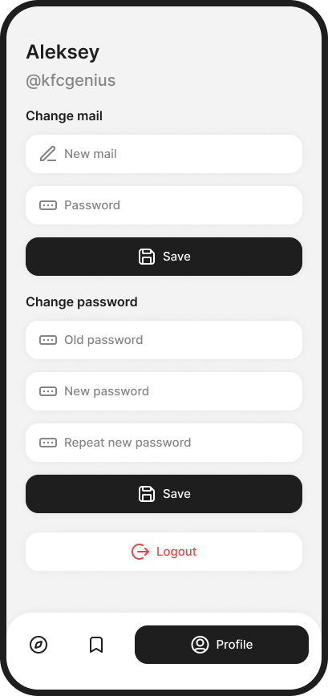
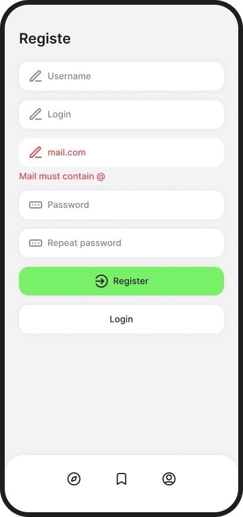

# UI

UI in [Figma](https://www.figma.com/design/Ea5F84bR3B9uU4NZpn3ol0/Main?node-id=0-1&t=Od5K8B5y4375MWle-1) is a little bit outdated but it still can be used as a reference. Latest version of current UI you can see by running frontend part.

